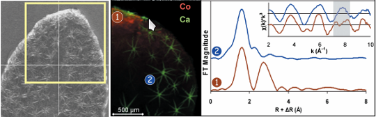
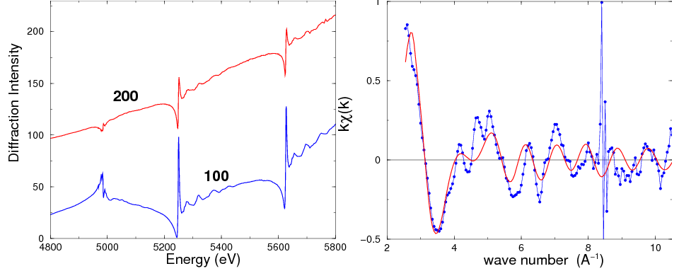
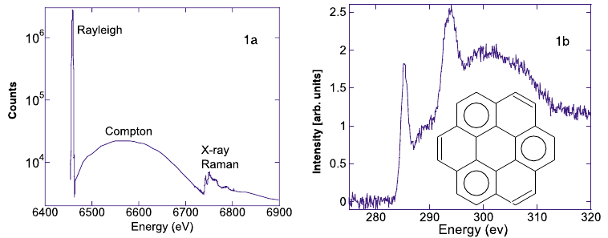

Use cases for the XAS Data Interchange format
=============================================

# Conventional XAS

In a conventional XAS experiment, we measure a sample somewhere
between 2 and 10,000 times, possibly requiring dead-time or other
corrections.  Some data processing is required to correct, calibrate,
and/or align the data.  Those scans are then merged into a single
spectrum.

XDI is about how we express the merged spectrum.  In some case, XDI
may also be a suitable format for the individual XAS measurements, as
well.

# XRF imaging experiments

In an imaging experiments the heterogeneity of our samples is
measured. XAS can be measured on particular spots.  In this example
(Tappero et al, New Phytologist 175:4, 641-654, (2007)
[doi:10.1111/j.1469-8137.2007.02134.x](http://dx.doi.org/10.1111/j.1469-8137.2007.02134.x)),
the Co and Ca distribution in leaf of a metal accumulating plant is
shown.  Co micro-XAS spectra are measured at two spots on the leaf.

XDI is about how we express the micro-XAS spectrum extracted from
the imaging experiment.

# Difraction anomalous fine structure (DAFS)

An anomalous scattering experiments yields energy-dependent scattering
intensities.  Here we see DAFS data measured (Ravel et al. PRB 60,
778-785 (1999)
[doi:10.1103/PhysRevB.60.778](http://dx.doi.org/10.1103/PhysRevB.60.778))
near the Ti K and Ba L3 edges on BaTiO3.  From these data, mu(E) or
chi(k) spectra are extracted and interpreted as position-selective
EXAFS.

XDI is about how we express the mu(E) or chi(k) spectrum extracted from
the anomalous diffraction measurement.

# Non-resonant inelastic scattering

A NIXS experiment can used to measure a XANES spectrum in an X-ray
energy loss channel.  Here we see a XANES-like spectrum for graphite
in the X-ray Raman channel, superposed over the Comptopn
scattering. (Bergmann, et al. Chem. Phys. Lett. 369 184 (2003)
[doi:10.1016/S0009-2614(02)02003-1](http://dx.doi.org/10.1016/S0009-2614(02)02003-1))

XDI is about how we express the mu(E) spectrum extracted from the
non-resonant inelastic scattering measurement.
